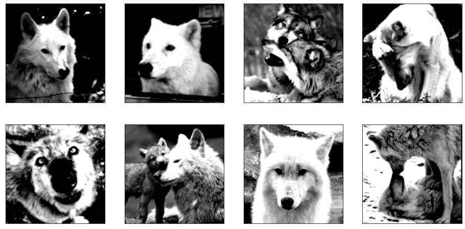
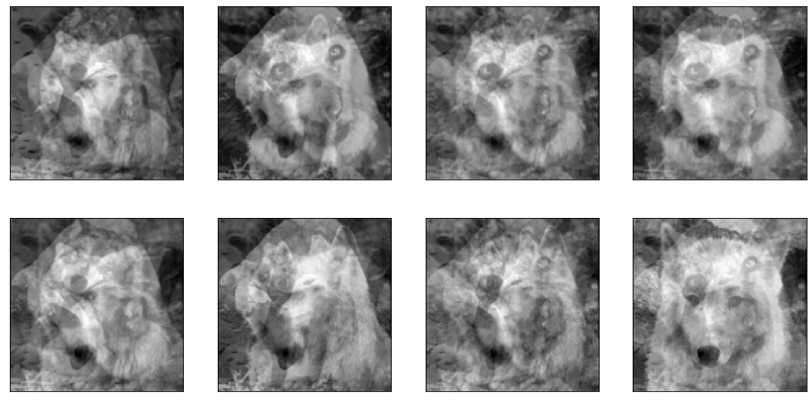
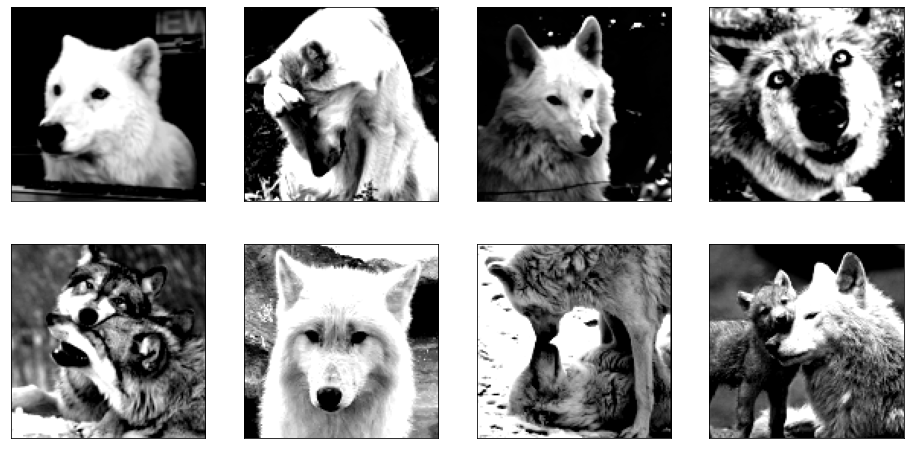

# CAMNS
This repository contains an implementation of non-negative Blind Source Separation method based on [the following paper](https://www.researchgate.net/publication/251134144_A_Convex_Analysis_Framework_for_Blind_Separation_of_NonNegative_Sources)

File `camns.py` contains implementation of the method relying on `CVXPY` as an optimizer.

File `demo.ipynb` contains demonstration of the method using mixing and separating images of wolves as an example. *Note*: demonstration requires you to have plenty of RAM available for the Convex Optimization solver to run.

## Fluffy example from the notebook🐺
Originally, we have eight source images:

By applying random mixture matrix, we obtain eight mixed signals

Finally, applying our implementation of the algorithms allows us to retrieve the approximation of the original ones

This is it! Please check out the implementation of the algorithm and sample notebook.